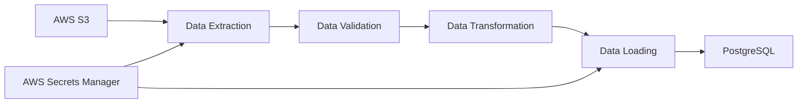

# S3 to PostgreSQL ETL Pipeline Documentation

## 1. Executive Summary

This ETL (Extract, Transform, Load) pipeline automates the process of extracting CSV data from AWS S3, validating and transforming it, and loading it into a PostgreSQL database. It addresses the business need for efficient, reliable data processing from cloud storage to a structured database system.

Key features:
- Automated extraction of CSV files from S3
- Data validation and quality checks
- Configurable data transformations
- Secure loading into PostgreSQL
- Error handling and retry mechanisms
- Logging for monitoring and debugging

This solution enables data teams to process large volumes of data with minimal manual intervention, ensuring data integrity and consistency throughout the pipeline.

## 2. Architecture Overview



Design decisions:
- Modular architecture for easy maintenance and extensibility
- Use of AWS services (S3, Secrets Manager) for scalability and security
- Configuration-driven approach for flexibility
- Pandas for efficient data manipulation
- Retry mechanism with exponential backoff for resilience

## 3. Technical Specifications

Technologies used:
- Python 3.7+
- AWS SDK (boto3)
- Pandas for data manipulation
- psycopg2 for PostgreSQL interaction
- PyYAML for configuration management

Data flow:
1. CSV files read from S3
2. Schema validation and data quality checks
3. Data transformation based on configuration
4. Transformed data loaded into PostgreSQL

Integrations:
- AWS S3 for data source
- AWS Secrets Manager for secure credential management
- PostgreSQL as the target database

## 4. Setup & Installation

Prerequisites:
- Python 3.7+
- AWS account with S3 and Secrets Manager access
- PostgreSQL database

Installation steps:
1. Clone the repository:
   ```
   git clone https://github.com/your-repo/s3-to-postgres-etl.git
   cd s3-to-postgres-etl
   ```
2. Install required packages:
   ```
   pip install -r requirements.txt
   ```
3. Set up AWS credentials (use AWS CLI or IAM roles)
4. Create necessary secrets in AWS Secrets Manager
5. Update `config.yaml` with your specific settings

## 5. Configuration

Environment variables:
- For local development, set PostgreSQL connection details as environment variables

Secrets management:
- Store sensitive information in AWS Secrets Manager
- Reference secrets in `config.yaml` using secret names

Customization options:
- Modify `config.yaml` to adjust:
  - S3 bucket and input files
  - Expected schema and data quality rules
  - Data transformations
  - PostgreSQL connection details

## 6. Usage Guide

To run the pipeline:
```
python main.py
```

The system will:
1. Read each configured input file from S3
2. Validate the data against the expected schema
3. Perform configured data quality checks
4. Apply specified transformations
5. Load the processed data into PostgreSQL

Logs are written to stdout by default.

## 7. Security Considerations

- Use IAM roles for AWS service authentication
- Store sensitive information in AWS Secrets Manager
- Implement least privilege principle for IAM policies
- Ensure S3 bucket has appropriate access controls
- Use SSL/TLS for database connections
- Regularly rotate credentials and review access policies

## 8. Testing

Test strategy:
- Unit tests for individual components
- Integration tests for the complete pipeline
- Mocking of AWS services for local testing

To run tests:
```
pytest
```

Current test coverage focuses on the main processing function and its components.

## 9. Deployment

Deployment options:
1. EC2 instance with appropriate IAM role
2. ECS task with IAM role
3. AWS Lambda for serverless deployment (requires code adaptation)

Monitoring:
- Set up CloudWatch alarms for S3 events and application metrics
- Configure logging to CloudWatch Logs
- Monitor PostgreSQL performance and scale as needed

## 10. Troubleshooting

Common issues:
1. S3 access denied: Check IAM permissions
2. Secret not found: Verify secret names in Secrets Manager
3. Database connection failed: Check network settings and credentials
4. Data quality checks failing: Review input data and quality rules

For all issues, check application logs for detailed error messages.

## 11. Next Steps

Suggested improvements:
1. Implement data versioning in PostgreSQL
2. Add support for incremental loads
3. Develop a web interface for pipeline monitoring
4. Integrate with a workflow orchestration tool (e.g., Apache Airflow)
5. Implement automated data profiling and anomaly detection
6. Extend support for additional input and output formats

## 12. Conclusion

This ETL pipeline provides a robust solution for processing CSV data from S3 to PostgreSQL. It offers flexibility through configuration, ensures data quality, and implements best practices for security and error handling. Regular maintenance and monitoring will ensure its continued effectiveness in meeting business data processing needs.